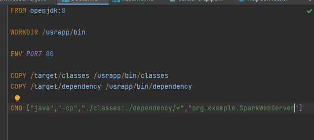

### AREP PARCIAL

[VIDEO](https://youtube.com/shorts/K1rFYwLsAOw?feature=share)

#### Como clonarlo y compilarlo
1) ````git clone https://github.com/javier32rojas040506/arep-parcial2.git````
2) ``mvn package``
## ARQUITECTURA
En este caso implementamos un servidor web que expone uno archivos estaticos que sirven de cliente web


El cliente envia un enpoint especificando el value por un query param


del tipo

http://host:{port}/collatzsequence?value=13


por el lado del servidor atendemos a la solicitud con un get asi;


## Local steps
1) CREAR DOCKER FILE
  


3) Construir imagen

``` docker build --tag parcial-arep . ```

4) correr contenedor

``docker run -d -p 80:80 --name parcial fj32rojas/parcial-arep``


## AWS STEPS
1) CREAR DOCKER FILE


3) Construir imagen

``` docker build --tag parcial-arep . ```

3) crear repo


5) crear tag con repo

```` docker tag parcial-arep/fj32rojas ````

5) conectarse a instancia y descragar docker


7) correr contenedor


``sudo docker run -d -p 80:80 --name parcial fj32rojas/parcial-arep``


7) Verifique que tenga los puertos abiertos


8) pruebe con la ip de su instancia


